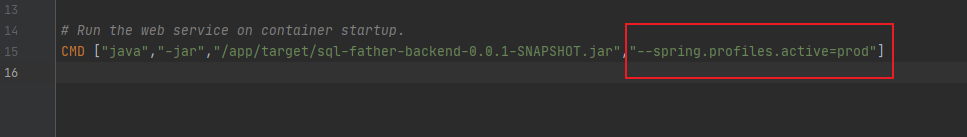

因为鱼皮原有的dockerfile中在启动服务时使用了--spring.profiles.active=prod参数，这个参数代表生产环境。所以需要修改原项目 https://github.com/liyupi/sql-father-backend-public 的 application-prod.yml文件




```
spring:
  # 数据库配置
  datasource:
    driver-class-name: com.mysql.cj.jdbc.Driver
    url: jdbc:mysql://mysql:3306/sqlfather?useUnicode=true&characterEncoding=utf8&useSSL=false
    username: root
    password: 123456
mybatis-plus:
  configuration:
    # 生产环境关闭日志
    log-impl: ''

```
将数据库的localhost改为mysql的容器名：mysql